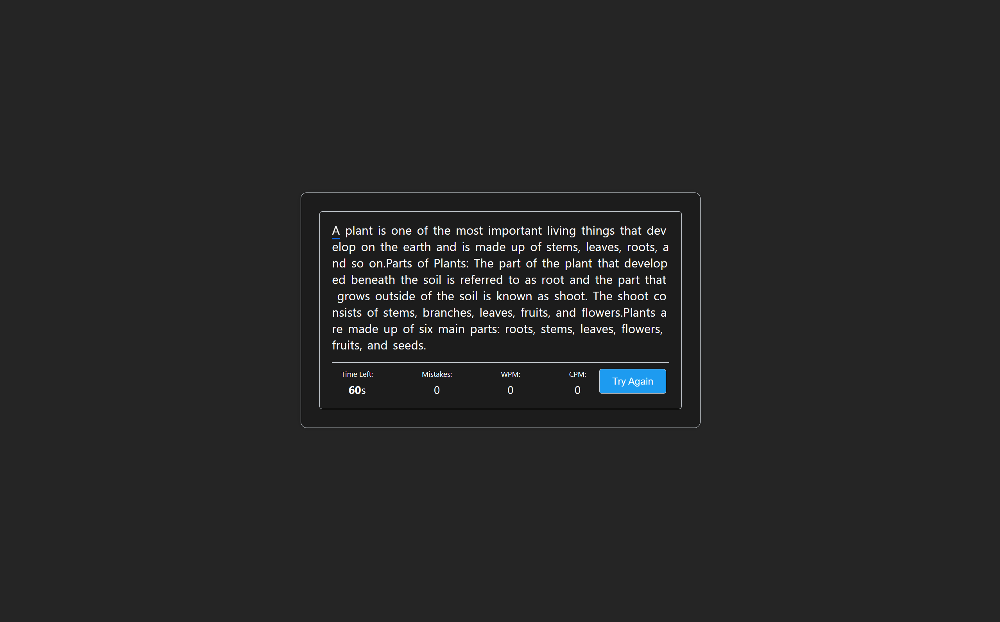

# Speed Writer

This is a speed writer app, That test how fast you can type on your keyboard.
The app code already been published on [GeeksForGeeks](https://www.geeksforgeeks.org/typing-speed-tester-using-react/).

But unfortunately, the app is not working properly on the GeeksForGeeks website. So, I decided to make a new repository for the app and fix the issues.

## The issues that I fixed

1. All the letter are red no matter what you type.
2. Fix the extra space issue.
3. Fix the issue of the timer not stopping when the test is finished.
4. Change some css to make font family and font size more readable.
5. Made it in dark mode, because I like dark mode (⌐■_■).
6. Added a new animation for pointer.

and here is the new repository for the app: [Speed Writer](https://github.com/i1Zeus/speed-writer)

## How to run the app

1. Clone the repository
2. Run `npm install`
3. Run `npm start`
4. Open [http://localhost:3000](http://localhost:3000) to view it in the browser.
5. Enjoy typing!

## App Preview

